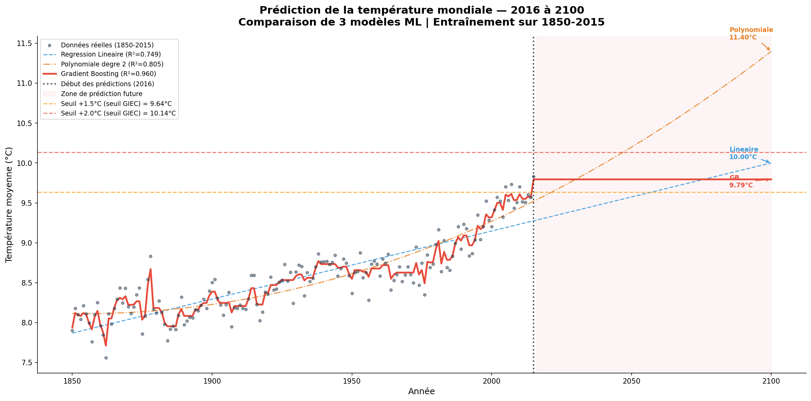
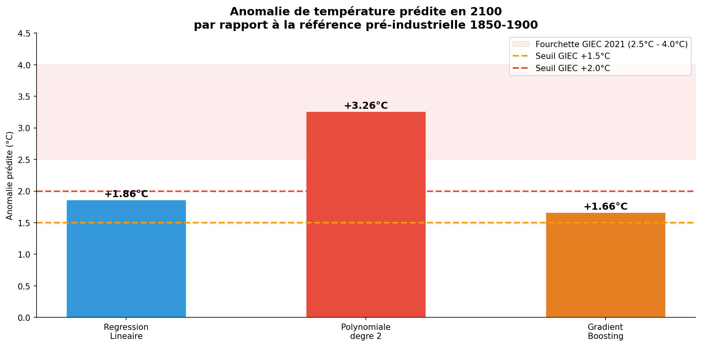
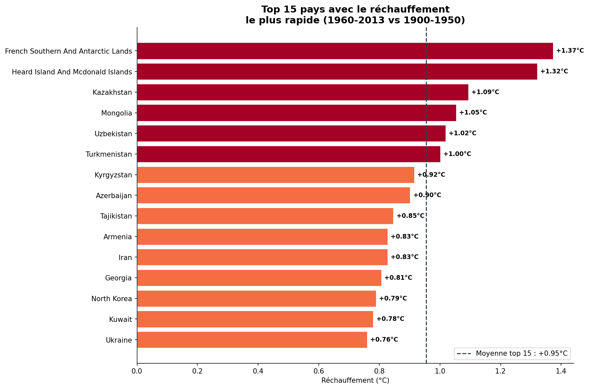

# Analyse du Changement Climatique — Températures Mondiales 1750-2015


---

## Description

Analyse exploratoire de 265 ans de données climatiques mondiales.
Etude de l'évolution des températures terrestres depuis 1750,
modélisation ML et prédiction du réchauffement jusqu'en 2100,
cartographie mondiale du réchauffement par pays.

> Projet portfolio — en lien direct avec mon expertise
> en qualité de l'air et sciences de l'atmosphère
> acquise chez Atmo Guyane.

---

## Dataset

| Indicateur | Valeur |
|---|---|
| Source | Berkeley Earth — Kaggle |
| Période | 1750 à 2015 |
| Fréquence | Mensuelle |
| Lignes globales | 3 180 mesures |
| Lignes par pays | 544 811 mesures |
| Pays couverts | 242 |
| Fichiers | 5 fichiers CSV |

Fichiers utilisés :

```
GlobalTemperatures.csv               temperatures mondiales
GlobalLandTemperaturesByCountry.csv  par pays (242 pays)
GlobalLandTemperaturesByMajorCity.csv par grande ville
```

---

## Résultats clés

| Indicateur | Valeur |
|---|---|
| Temperature reference pre-industrielle (1850-1900) | 8.14 C |
| Temperature 2015 | 9.83 C |
| Rechauffement total mesure | +1.80 C |
| Decennie la plus chaude | 2010 (+1.49 C) |
| Seuil GIEC depasse | Oui — seuil +1.5 C franchi |
| Prediction 2100 (Polynomiale deg 2) | +3.26 C |
| Pays qui se rechauffe le plus vite | Kazakhstan (+1.09 C) |
| Pays le plus chaud | Djibouti (28.88 C) |

---

## Analyses réalisées

**Exploration des données**
- 265 ans de mesures mensuelles de 1750 a 2015
- Conversion et extraction des composantes temporelles
- Statistiques descriptives et répartition par siècle

**Visualisations produites**

Evolution des temperatures 1750-2015
- Courbe brute et moyenne mobile sur 10 ans
- Ligne de reference pre-industrielle (1850-1900)
- Annotation de la revolution industrielle (1850)
- Mise en evidence du rechauffement +1.80 C

Anomalies thermiques style NASA
- Barres rouges et bleues selon ecart a la reference
- Annotations des grandes eruptions volcaniques
- Seuils GIEC +1.5 et +2.0 C

Analyse par decennie
- Degrade de couleur bleu vers rouge
- Les 4 decennies les plus chaudes sont toutes apres 1980
- Annotation des evenements climatiques majeurs

**Evenements naturels identifies**
- Eruption Laki 1783 — hiver extreme
- Eruption Tambora 1815 — annee sans ete
- Eruption Krakatoa 1883 — refroidissement 2 ans
- Eruption Pinatubo 1991 — baisse de 0.5 C
- Oscillations El Nino / La Nina visibles

---

## Analyse de linearite

| Methode | Resultat |
|---|---|
| Correlation Pearson | 0.6223 |
| Correlation Spearman | 0.6144 |
| Difference | 0.0079 — relation lineaire confirmee |
| R2 degre 1 | 0.387 |
| R2 degre 2 | 0.531 — gain significatif |
| R2 degre 3+ | 0.532 — aucun gain supplementaire |

Conclusion : relation lineaire moderee avec
legere composante non-lineaire capturee par le degre 2.

---

## Modelisation ML et prediction 2100

| Modele | R² (1850-2015) | Prediction 2100 | Anomalie vs ref |
|---|---|---|---|
| Regression Lineaire | 0.749 | 10.00 C | +1.86 C |
| Polynomiale degre 2 | 0.805 | 11.40 C | +3.26 C |
| Gradient Boosting | 0.960 | 9.79 C | +1.66 C |

Meilleur modele pour extrapolation : Polynomiale degre 2

- R² = 0.805 sur les donnees historiques
- Prediction +3.26 C coherente avec les scenarios GIEC SSP2-4.5
- Capture l'acceleration du rechauffement apres 1980

Lecon importante :
- GB excellent en interpolation (R²=0.96) mais inutile en extrapolation
- La complexite n'est pas toujours meilleure pour predire le futur
- Un modele simple et adapte au probleme surpasse un modele complexe

---

## Analyse mondiale par pays (1900-2013)

**Top 5 pays les plus chauds**

| Rang | Pays | Temp. moyenne |
|---|---|---|
| 1 | Djibouti | 28.88 C |
| 2 | Mali | 28.62 C |
| 3 | Burkina Faso | 28.29 C |
| 4 | Senegal | 28.13 C |
| 5 | Aruba | 28.12 C |

**Top 5 pays qui se réchauffent le plus vite**

| Rang | Pays | Rechauffement |
|---|---|---|
| 1 | Terres australes françaises | +1.37 C |
| 2 | Heard Island | +1.32 C |
| 3 | Kazakhstan | +1.09 C |
| 4 | Mongolie | +1.05 C |
| 5 | Ouzbekistan | +1.02 C |

Observation : les pays continentaux d'Asie centrale
et les zones polaires se rechauffent le plus vite
— confirme l'amplification arctique et continentale
documentee par le GIEC.

---

## Visualisations

### Evolution des temperatures mondiales


### Anomalies thermiques avec eruptions volcaniques


### Anomalies par decennie


### Predictions 2100 — comparaison des 3 modeles


### Comparaison des anomalies predites en 2100


### Top 15 pays — rechauffement le plus rapide


Les cartes interactives sont disponibles dans outputs/ :
- 06_carte_temperature_pays.html
- 07_carte_rechauffement_pays.html

---

## Stack technique

| Librairie | Usage |
|---|---|
| pandas | Manipulation et nettoyage des donnees |
| numpy | Calculs numeriques et transformations |
| matplotlib | Visualisations statiques avancees |
| seaborn | Graphiques statistiques |
| plotly | Cartes interactives et visualisations |
| scipy | Tests statistiques (Pearson, Spearman) |
| scikit-learn | Modeles ML, Pipeline, extrapolation 2100 |

---

## Lancer le projet

```bash
git clone https://github.com/VOTRE_USERNAME/climate-change-analysis.git
cd climate-change-analysis
pip install -r requirements.txt
jupyter notebook notebooks/analyse_climat.ipynb
```

---

## Structure

```
climate-change-analysis/
├── data/
│   ├── GlobalTemperatures.csv
│   ├── GlobalLandTemperaturesByCountry.csv
│   ├── GlobalLandTemperaturesByMajorCity.csv
│   ├── GlobalLandTemperaturesByState.csv
│   └── GlobalLandTemperaturesByCity.csv
├── notebooks/
│   └── analyse_climat.ipynb
├── outputs/
│   ├── 01_evolution_temperature.png
│   ├── 02_anomalies_thermiques.png
│   ├── 03_anomalies_decennies.png
│   ├── 04_predictions_2100.png
│   ├── 05_comparaison_predictions_2100.png
│   ├── 06_carte_temperature_pays.html
│   ├── 07_carte_rechauffement_pays.html
│   └── 08_top15_rechauffement.png
├── README.md
└── requirements.txt
```

---

## Statut du projet

- [x] Chargement et exploration des donnees
- [x] Nettoyage et traitement des valeurs manquantes
- [x] Conversion et extraction temporelle
- [x] Statistiques descriptives
- [x] Evolution des temperatures 1750-2015
- [x] Anomalies thermiques style NASA + eruptions
- [x] Analyse par decennie
- [x] Analyse de linearite (Pearson, Spearman, R2)
- [x] Modelisation ML — 3 modeles compares
- [x] Prediction temperature 2100
- [x] Analyse par pays — carte mondiale interactive
- [x] Top 15 pays rechauffement le plus rapide
- [ ] Analyse par grandes villes
- [ ] README final complet

---

## Auteur

Mouad AOUS — Ingenieur Qualite de l'Air | Data Analyst
LinkedIn : https://www.linkedin.com/in/mouad-aous/
Email : mouad.aous97@gmail.com