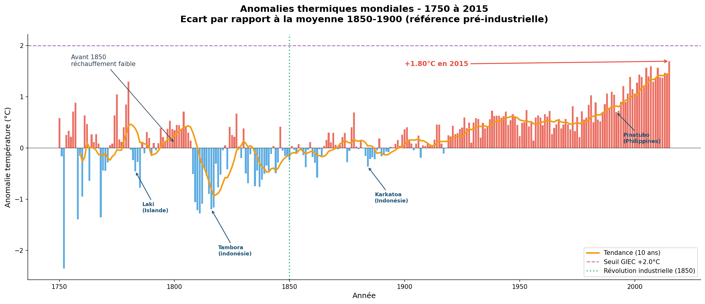
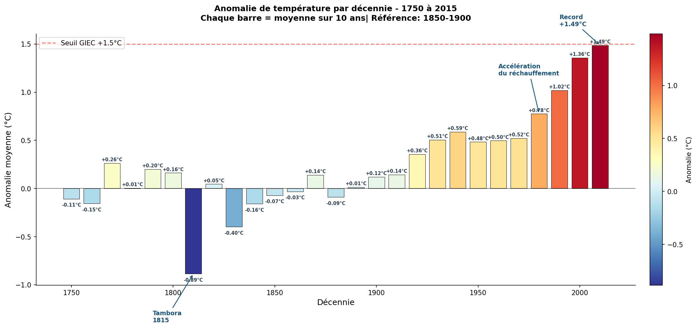

# Analyse du Changement Climatique — Températures Mondiales 1750-2015


---

## Description

Analyse exploratoire de 265 ans de données climatiques mondiales.
Etude de l'évolution des températures terrestres depuis 1750,
identification des anomalies thermiques et visualisation
de la tendance au réchauffement climatique.

> Projet portfolio — en lien direct avec mon expertise
> en qualité de l'air et sciences de l'atmosphère
> acquise chez Atmo Guyane.

---

## Dataset

| Indicateur | Valeur |
|---|---|
| Source | Berkeley Earth — Kaggle |
| Période | 1750 à 2015 |
| Fréquence | Mensuelle |
| Lignes | 3 180 mesures |
| Fichiers | 5 fichiers CSV |

Fichiers utilisés :

```
GlobalTemperatures.csv              temperatures mondiales
GlobalLandTemperaturesByCountry.csv par pays
GlobalLandTemperaturesByMajorCity.csv par grande ville
```

---

## Résultats clés

| Indicateur | Valeur |
|---|---|
| Temperature reference pre-industrielle (1850-1900) | 8.03 C |
| Temperature 2015 | 9.83 C |
| Rechauffement total mesure | +1.80 C |
| Decennie la plus chaude | 2010 (+1.49 C) |
| Seuil GIEC depasse | Oui — seuil +1.5 C franchi |

---

## Analyses réalisées

**Exploration des données**
- 265 ans de mesures mensuelles de 1750 a 2015
- Identification et traitement de 19 colonnes avec valeurs manquantes
- Conversion et extraction des composantes temporelles

**Visualisations produites**

Evolution des temperatures 1750-2015
- Courbe brute et moyenne mobile sur 10 ans
- Ligne de reference pre-industrielle
- Annotation de la revolution industrielle (1850)

Anomalies thermiques style NASA
- Barres rouges et bleues selon ecart a la reference
- Annotations des grandes eruptions volcaniques
- Seuils GIEC +1.5 et +2.0 C

Analyse par decennie
- Degradé de couleur bleu vers rouge
- Les 4 decennies les plus chaudes sont toutes apres 1980

**Evenements naturels identifies**
- Eruption Tambora 1815 — annee sans ete
- Eruption Krakatoa 1883 — refroidissement 2 ans
- Eruption Pinatubo 1991 — baisse de 0.5 C
- Oscillations El Nino / La Nina visibles

---

## Analyse de linearite

| Methode | Resultat |
|---|---|
| Correlation Pearson | 0.6223 |
| Correlation Spearman | 0.6144 |
| Difference | 0.0079 — relation lineaire confirmee |
| R2 degre 1 | 0.387 |
| R2 degre 2 | 0.531 — gain significatif |
| R2 degre 3+ | 0.532 — aucun gain supplementaire |

Conclusion : relation lineaire moderee avec
legere composante non-lineaire capturee
par le degre 2.

---

## Visualisations

### Evolution des temperatures mondiales


### Anomalies thermiques avec eruptions volcaniques


### Anomalies par decennie


---

## Stack technique

| Librairie | Usage |
|---|---|
| pandas | Manipulation et nettoyage des donnees |
| numpy | Calculs numeriques et transformations |
| matplotlib | Visualisations statiques avancees |
| seaborn | Graphiques statistiques |
| plotly | Visualisations interactives |
| scipy | Tests statistiques (Pearson, Spearman) |
| scikit-learn | Modeles ML et analyse de linearite |

---

## Lancer le projet

```bash
git clone https://github.com/VOTRE_USERNAME/climate-change-analysis.git
cd climate-change-analysis
pip install -r requirements.txt
jupyter notebook notebooks/analyse_climat.ipynb
```

---

## Structure

```
climate-change-analysis/
├── data/
│   ├── GlobalTemperatures.csv
│   ├── GlobalLandTemperaturesByCountry.csv
│   ├── GlobalLandTemperaturesByMajorCity.csv
│   ├── GlobalLandTemperaturesByState.csv
│   └── GlobalLandTemperaturesByCity.csv
├── notebooks/
│   └── analyse_climat.ipynb
├── outputs/
│   ├── 01_evolution_temperature.png
│   ├── 02_anomalies_thermiques.png
│   └── 03_anomalies_decennies.png
├── README.md
└── requirements.txt
```

---

## Statut du projet

- [x] Chargement et exploration des donnees
- [x] Nettoyage et traitement des valeurs manquantes
- [x] Conversion et extraction temporelle
- [x] Statistiques descriptives
- [x] Evolution des temperatures 1750-2015
- [x] Anomalies thermiques style NASA
- [x] Analyse par decennie
- [x] Analyse de linearite (Pearson, Spearman, R2)
- [ ] Modelisation ML et prediction 2100
- [ ] Analyse par pays (carte mondiale)
- [ ] Analyse par grandes villes
- [ ] README final

---

## Auteur

Mouad AOUS — Ingenieur Qualite de l'Air | Data Analyst
LinkedIn : https://www.linkedin.com/in/mouad-aous/
Email : mouad.aous97@gmail.com